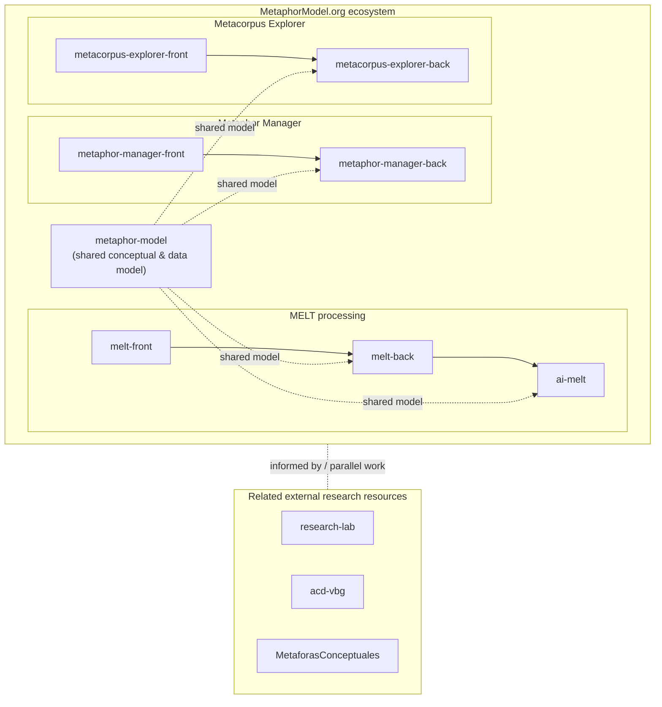

# metaphor-model

Shared conceptual and data model for the [MetaphorModel.org](https://metaphormodel.org)
research software ecosystem. This repository defines the vocabulary, entities,
and relationships that other MetaphorModel.org components use when describing,
annotating, and processing conceptual metaphors and cultural narratives.

It is not a standalone application. It is the modelling layer that gives the
ecosystem a common semantic ground.

## Research context

MetaphorModel.org is a doctoral research software ecosystem for analysing
conceptual metaphors and cultural narratives in textual corpora. It is being
developed in the context of the PhD research of María Isabel Marín Morales at
the Graduate School for the Humanities, University of Groningen, under the
supervision of Prof. Dr. Pablo Valdivia.

The ecosystem builds on Metaphor Field-Loop Theory (MELT) and applies it to
real-world corpora — currently including the report of the Colombian Truth
Commission as a test case — in order to study how cultural narratives are
configured and how they relate to social mobilization.

## Role in MetaphorModel.org

`metaphor-model` serves as the **shared conceptual and data model** of the
ecosystem. Its purpose is to:

- Provide a single, explicit vocabulary for the entities involved in
  metaphor and narrative analysis (textual sources, metaphorical
  expressions, conceptual metaphors, scenarios, regimes, cultural
  narratives, annotations, provenance).
- Make the modelling choices behind the ecosystem visible and inspectable,
  rather than implicit in each application.
- Act as a reference point for the front-end, back-end, and AI processing
  components, so that interpretation, storage, and computation stay
  aligned.

This repository does not implement the user-facing tools or the processing
pipeline. Those live in the related repositories listed below.

## Ecosystem overview

The dashed arrows from `metaphor-model` indicate that the other components
reference and rely on the shared model — not that they import a packaged
artefact from this repository. The exact integration mechanism may evolve
during the dissertation.

## Core conceptual entities

The model is organised around the following entities. They are described in
more detail in [`docs/schema-overview.md`](docs/schema-overview.md).

- **Textual source** — a document or corpus item from which metaphorical
  language is extracted (e.g. a section of a report, an interview, a press
  article).
- **Metaphorical expression** — a concrete linguistic occurrence in a
  textual source identified as metaphorical.
- **Focus** — the lexical unit (or units) of the metaphorical expression
  that carry the metaphorical meaning.
- **Conceptual metaphor** — the underlying cross-domain mapping that
  motivates one or more metaphorical expressions.
- **Source domain** — the conceptual domain from which the mapping draws.
- **Target domain** — the conceptual domain that the mapping structures.
- **Ontological correspondence** — a mapping between entities of the
  source and target domains.
- **Epistemic correspondence** — a mapping between knowledge or inferences
  associated with the source and target domains.
- **Metaphor scenario** — a structured situation type built from one or
  more conceptual metaphors, with roles and a typical script.
- **Metaphor regime** — a higher-level configuration of scenarios that
  characterises how a discourse community talks about a given topic.
- **Cultural narrative** — a narrative pattern in which metaphor regimes
  and scenarios participate, connecting metaphor to broader cultural and
  political meaning-making.
- **Annotation** — an interpretive act linking a textual source to one or
  more of the entities above, performed by a human annotator, an AI
  component, or a combination of both.
- **Provenance / review information** — metadata describing who produced
  an annotation, when, with which tool or model, and the review status of
  the annotation.

## Repository contents

This repository is currently minimal. It contains:

- `README.md` — this document.
- `Dockerfile` and `public/` — a small static landing page that
  introduces the ecosystem.
- `docs/` — conceptual documentation (schema overview, architecture
  notes, FAIR and sustainability notes).
- `CITATION.cff` — citation metadata.

The formal, machine-readable schema artefacts (for example shared type
definitions or serialisations) are expected to be added as the modelling
work consolidates. Until then, this repository functions primarily as the
**conceptual reference** for the ecosystem.

## Related repositories

Components of MetaphorModel.org:

- `metaphor-manager-front` — front-end for registering and organising
  metaphorical expressions from corpora.
- `metaphor-manager-back` — back-end services for the Metaphor Manager.
- `melt-front` — front-end for MELT-based metaphor detection and
  analysis.
- `melt-back` — back-end services for MELT processing.
- `ai-melt` — AI/NLP processing components supporting MELT.
- `metacorpus-explorer-front` — front-end for exploring research corpora
  (including the Colombian Truth Commission report).
- `metacorpus-explorer-back` — back-end services for the corpus
  explorer.

Related external research resources — referenced or used in parallel, but
**not internal components** of MetaphorModel.org:

- `research-lab` — collaborative research space.
- `acd-vbg` — a related research resource.
- `MetaforasConceptuales` — a related research resource on conceptual
  metaphors.

## FAIR, reproducibility, and sustainability

See [`docs/fair-and-sustainability.md`](docs/fair-and-sustainability.md) for
the full notes. In summary, the repository aims to support:

- explicit, versioned documentation of the model;
- interoperability across the ecosystem's components;
- clear separation between model, data, processing, and interface layers;
- awareness of sensitive data, especially when working with corpora that
  document political violence and human rights testimony.

## Status

Active research software / doctoral research prototype. Interfaces and
schemas may evolve alongside the dissertation. This repository should not
be assumed to be production-ready, and downstream users should pin to a
specific commit if they need stability.

## Citation

If you refer to this repository in academic work, please cite it using the
metadata in [`CITATION.cff`](CITATION.cff).

## Contact

María Isabel Marín Morales — PhD candidate, Graduate School for the
Humanities, University of Groningen. Supervision by Prof. Dr. Pablo
Valdivia. Funded by Convocatoria 906/2021 of the Colombian Ministry of
Science, Technology and Innovation (Minciencias).
